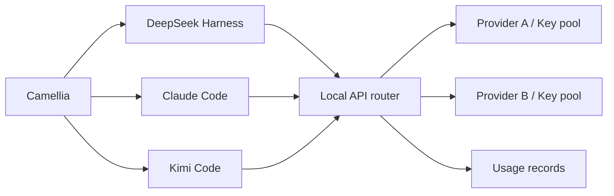

<p align="center">
  
</p>

<h1 align="center">Camellia</h1>

<p align="center">A desktop workbench for coding agents.</p>

<p align="center"><strong>English</strong> · <a href="README.zh-CN.md">简体中文</a></p>

Camellia brings **DeepSeek Harness, Claude Code, and Kimi Code** into one desktop application. It centralizes provider credentials, model routing, usage tracking, and engine settings while preserving each engine's execution model and conversation history.


## Features

- **Multiple engines, one application.** Switch between DSH, Claude Code, and Kimi Code with shared navigation and settings.
- **Workspace and standalone conversations.** Organize Claude and Kimi sessions by local folder, or start without a workspace. Pin, rename, fork, archive, and resume sessions.
- **Centralized API management.** Configure providers, import and label keys, discover models, and validate connections in one place.
- **Same-model failover.** Retry eligible failures through another key or provider serving the same configured model. Camellia never substitutes a different model automatically.
- **Usage and account visibility.** Filter local requests and token statistics by provider, key, model, and date. View balances, subscription limits, and observed trends for supported account APIs.
- **Managed runtimes.** Prepare pinned engine versions automatically, with installation status and retry controls in settings.

## Getting started

### Requirements

- Windows x64 or macOS on Apple Silicon (ARM64)
- For source runs and builds: Node.js **22.19 or later in the 22.x series**, or **24 and later**. Desktop builds include Node.js.
- Git; on Windows, install Git for Windows with Bash for engine shell tools
- Network access for initial runtime installation, and credentials for a supported model provider

### Run from source

```sh
git clone https://github.com/chengwang96/Camellia.git
cd Camellia
npm ci
npm start
```

Installation prepares the pinned DSH, Kimi, and official Claude runtimes under `runtimes/`. Separate global CLI installations are not required. If a download fails, retry from **Settings → Runtime** or run `npm run setup:runtimes`.

The application defaults to English.

### Configure your first session

1. Open **Settings → Providers & Keys**.
2. Add a provider, enter API keys, and select or enter its available models.
3. Save the configuration and validate a key against the model you intend to use.
4. Return home, select an engine and model, and start a session. Claude and Kimi support both workspace and standalone sessions.

Connection validation sends a short model request and may incur a small charge. Reading a model catalog does not establish access to every listed model.

Use `Ctrl+,` to open settings and `Ctrl+Shift+H` to return home. On macOS, use `Cmd` instead of `Ctrl`.

## Engine integration

| Engine | Integration | Runtime in desktop builds |
| --- | --- | --- |
| DeepSeek Harness | Embedded web interface, with maintained source patches for settings integration and frontend startup | Bundled |
| Claude Code | Official CLI over stream-json, with a Camellia-managed desktop interface | Installed from the official npm package on first use |
| Kimi Code | Open-source runtime over the Agent Client Protocol (ACP), using the shared conversation interface | Bundled |

Source installation prepares all three runtimes. Desktop builds also include Node.js, npm, and pnpm. Shell tools use the native shell on macOS and require Git Bash on Windows.

Engine histories remain separate. DSH retains its native project model. Claude sessions can move between workspaces; existing Kimi ACP sessions retain their execution directory, so changing that directory requires a new session.

## Providers and routing

Engine selection and model-provider selection are independent. The engine manages tools and task execution; the local API router selects a configured route to the requested model.



Connection presets cover **Ollama Cloud, DeepSeek, Kimi / Moonshot, Kimi Code, Command Code GOAT, OpenCode Go, and OpenCode Zen**. Custom OpenAI Chat Completions and Anthropic Messages endpoints are supported, subject to protocol and model capabilities.

A route group must represent the **same model and version**, even when providers use different upstream names. Quota exhaustion, rate limits, authentication failures, and eligible temporary errors can advance to another route in that group. If no route remains, the request fails. Responses that have begun producing content are not replayed automatically.

Local usage records describe requests through Camellia. Account balances and subscription quotas come from provider APIs and may include other clients' activity. Some adapters use undocumented or client-derived endpoints. See the [configuration guide](docs/configuration.md#balances-and-subscription-quotas) for coverage and verification limits.

## Configuration and data

All engines share the application settings window, covering provider connections, usage, account balances, native engine options, runtime installation, and appearance.

**Saving native engine settings updates the corresponding CLI's global configuration**, which can affect CLI sessions outside Camellia. Existing files receive a one-time `.workbench.bak` backup before their first managed overwrite. The interface shows the affected paths.

Provider keys are stored in local configuration files. Engines use the local router URL and placeholder credentials; CLI sessions configured for that router require Camellia to remain running.

Application data lives in `%APPDATA%/dsh-desktop` on Windows and `~/Library/Application Support/dsh-desktop` on macOS. The existing directory name is retained so settings and sessions remain available. See [configuration and data locations](docs/configuration.md) for engine-specific paths and environment overrides.

<details>
<summary>Usage and balance interface — demonstration data</summary>


</details>

## Development

```sh
npm run dev    # Start the development application
npm test       # Run unit and local integration tests
npm run pack   # Build an unpacked application for the host platform
npm run dist   # Build distributable artifacts for the host platform
```

Build on the target platform: `npm run dist:win` produces a Windows x64 NSIS installer and portable ZIP; `npm run dist:mac` produces macOS ARM64 DMG and ZIP files. macOS builds require an Apple Silicon Mac running ARM64 Node.js.

Directory builds are at `dist/win-unpacked/Camellia.exe` or `dist/mac-arm64/Camellia.app`. Extract the Windows portable ZIP once and launch `Camellia.exe`. Keep the full extracted directory together, including `resources/`.

```text
assets/         Application icons
src/
  main/         Electron lifecycle, IPC, processes, and runtime management
  api/          Routing, protocol conversion, provider adapters, and usage
  engines/      Engine sessions, workspaces, and native settings
  renderer/     Home, conversation, settings, and shared styles
  shared/       Shared storage utilities
integrations/   Maintained upstream source patches
runtimes/       Per-engine package manifests and lockfiles
scripts/        Runtime preparation, packaging, and standalone utilities
tests/          Unit, integration, Electron, and browser checks
docs/           Guides, technical notes, and historical records
```

Build instructions, runtime pins, regression commands, and contribution guidance are in the [development guide](docs/development.md). Generated files under `build/` and `dist/` are not committed.

## Documentation and upstream projects

- [Configuration guide](docs/configuration.md) — providers, failover, native settings, usage, and local data.
- [Development guide](docs/development.md) — architecture, runtimes, testing, and packaging.
- [Documentation index](docs/README.md) — implementation notes and archived design records.

Camellia integrates [DeepSeek Harness](https://github.com/deepseek-ai/deepseek-harness), [Claude Code](https://github.com/anthropics/claude-code), and [Kimi Code](https://github.com/MoonshotAI/kimi-code). DSH and Kimi Code retain their MIT licenses. Claude Code is proprietary; Camellia integrates its official CLI without modifying or redistributing its core. Upstream components retain their respective licenses and terms.
