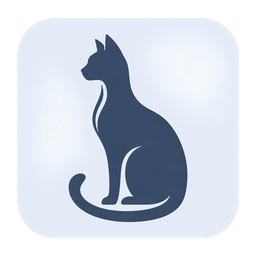
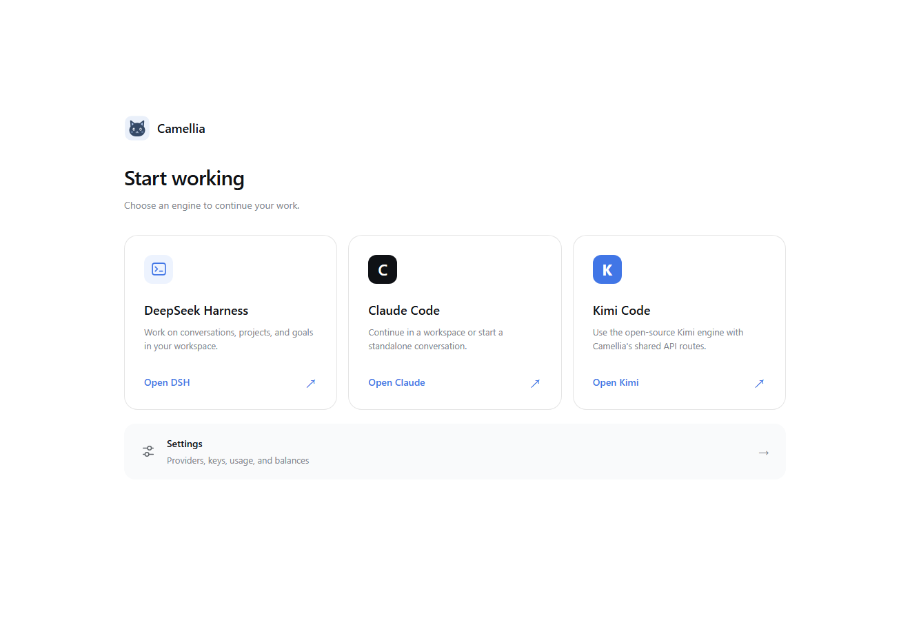
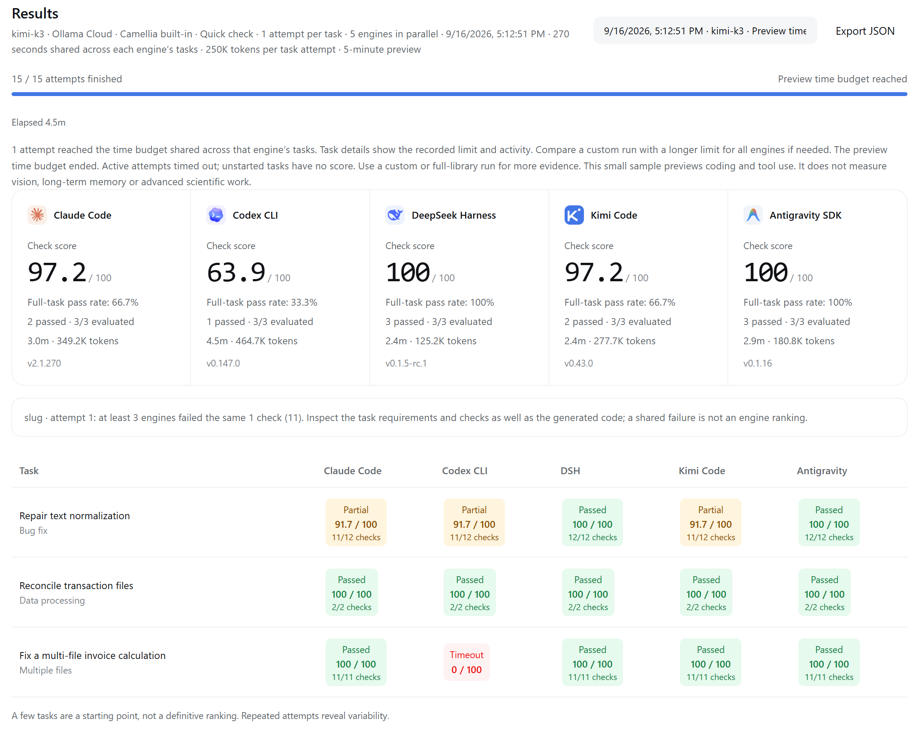
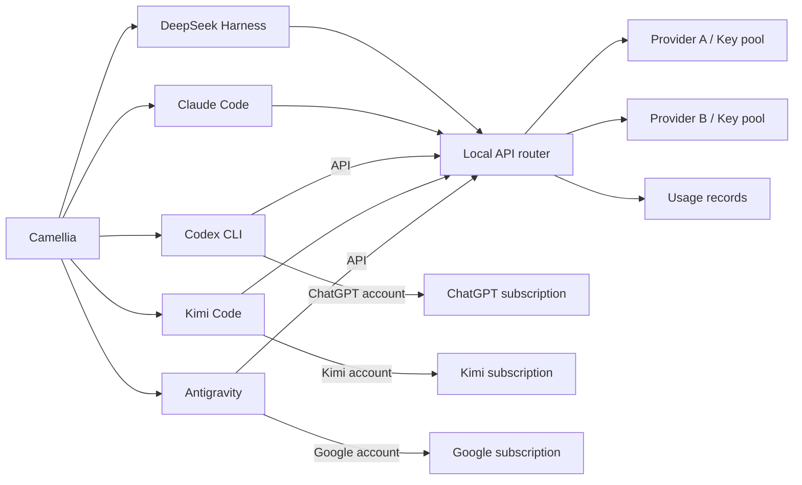
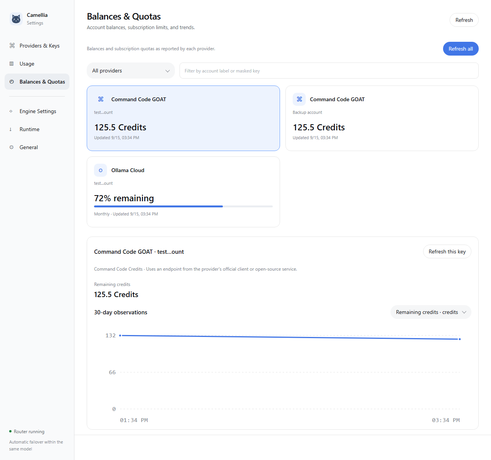

<p align="center">
  
</p>

<h1 align="center">Camellia</h1>

<p align="center">A desktop workbench for coding agents.</p>

<p align="center"><strong>English</strong> · <a href="README.zh-CN.md">简体中文</a></p>

Camellia brings **Claude Code, Codex CLI, DeepSeek Harness, Kimi Code, and Antigravity** into one desktop application. It centralizes provider credentials, model routing, usage tracking, and engine settings while preserving each engine's execution model and conversation history.

<table><tr><td>

</td></tr></table>

## Features

- **Queue messages while running.** Enter or Send queues messages until the current turn ends. Each queued message has a “Send instruction now” button to steer the active turn when supported by the engine connection. Failed instructions retain their queued text and attachments without changing the composer draft.
- **Multiple engines, one application.** Switch between Claude Code, Codex CLI, DSH, Kimi Code, and Antigravity with shared navigation and settings.
- **Shared conversations across five engines.** Keep one conversation and workspace while switching harnesses. Continue directly or use an automatic Markdown handoff. Start pages and active chats share an aligned composer.
- **Manual space cleanup.** Settings → Space cleanup → Scan previews categories, logical sizes and relative paths before permanent deletion. Only unowned Camellia conversation remnants, handoffs/summaries, pasted attachments and dedicated engine directories are eligible. Existing/archived/forked conversations, drafts, queued attachments and files modified within 24 hours are protected. Confirmation rechecks references and file identity; no background scans run. Workspace files, external files, original imports and shared/global native engine histories are excluded; deleted conversations' dedicated engine directories may include their private native state. Running conversations, unreadable/damaged references or more than 256 MiB of reference data stop cleanup; unsafe or oversized candidates are skipped. References in orphan records are protected too, so another manual scan may reclaim their attachments after those records are removed. Actual recovered disk space may differ from logical sizes.
- **Large pastes become attachments.** Pasting a long text block stores it as a `pasted-text-*.txt` attachment instead of a huge prompt; short pastes stay inline.
- **Deliverables appear below replies.** Successful file-writing tools and local file links or inline-code paths in replies produce deduplicated cards after an existence check. **Open with** offers Camellia or the system default app. Built-in previews cover images, audio/video, PDF, text, and DOCX/PPTX/XLSX content. Office previews do not reproduce original layout, images, charts or animations, or recalculate formulas; legacy DOC/PPT/XLS previews are not supported. Script-generated files should be linked in the reply. Shared conversations retain per-turn artifact records without scanning the workspace.
- **Centralized API management.** Configure providers, import and label keys, discover models, and validate connections in one place.
- **Same-model failover.** Retry eligible failures through another key or provider serving the same configured model. Camellia never substitutes a different model automatically.
- **Usage and account visibility.** Filter local requests and token statistics by provider, key, model, and date. View balances, subscription limits, and observed trends for supported account APIs.
- **Optional engine downloads.** Install only the engines you use, with pinned versions, download status, and retries in settings.
- **Compare five harnesses.** Run the same model and provider through all five engines in **Home → Benchmark**, with automatic task grading, time and token usage, saved reports, and JSON export.

## Getting started

### Requirements

- Windows x64 or macOS on Apple Silicon (ARM64)
- For source runs and builds: Node.js **22.19 or later in the 22.x series**, or **24 and later**. Desktop builds include Node.js.
- Git; on Windows, install Git for Windows with Bash for engine shell tools
- Network access for initial runtime installation, and credentials for a supported model provider

### Run from source

```sh
git clone https://github.com/chengwang96/Camellia.git
cd Camellia
npm ci
npm start
```

`npm ci` installs the workbench dependencies. All five harness runtimes are optional: choose **Download & open** on the home screen or download individual engines from **Settings → Runtime**. Antigravity downloads either its official CLI for Google subscriptions or the SDK and dedicated Python for API mode. Separate global CLI or Python installations are not required.

Before downloading, choose a direct connection or your saved proxy. Configure your own HTTP/HTTPS proxy in **Settings → Runtime → Download connection**. The default is direct, with no preset proxy address; this preference applies to engine and benchmark-library downloads.

For development, `npm run setup:runtimes -- dsh kimi` downloads only the named engines into `runtimes/`. Use `--all` only when you want all five. Launching the workbench or browsing settings does not download missing engines.

The application defaults to English. Switch between English and Simplified Chinese in **Settings → General → Language**, then save your preferences.

### Configure your first session

1. Open **Settings → Providers & Keys**.
2. Add a provider, enter API keys, and select or enter its available models.
3. Save the configuration and validate a key against the model you intend to use.
4. Return home, select an engine and model, and start a session. Claude, Codex, Kimi, and Antigravity support both workspace and standalone sessions.

For browser account sign-in, open **Settings → Providers & Keys → Account sign-in** and choose **Kimi account**, **Google account · Antigravity**, or **ChatGPT account**. The shortcut opens the matching engine's account settings and selects account mode as a draft. Save settings if prompted, then click its **Sign in** button. The API-provider dialog also links to Kimi and Google account settings; **Kimi Code (API key)** is the separate key-based connection.

To use your ChatGPT plan, open **Settings → Engine Settings → Codex CLI**, select **ChatGPT account**, save, and choose **Sign in with ChatGPT**. Camellia opens the official login in your browser and loads your account models and quota. Codex settings, credentials, and history stay in Camellia’s own data directory; your personal `~/.codex` is untouched. Select **API key / third-party API** to use the central Key pool instead.

To use a Google subscription, select **Settings → Engine Settings → Antigravity → Google subscription**, save, and choose **Sign in with Google**. Complete the official CLI sign-in, then **Refresh account** to load the models available to your account. This connection needs no API key.

To use a Kimi Code subscription, open **Settings → Engine Settings → Kimi Code**, choose **Kimi subscription** and your login region, save, then click **Sign in with Kimi**. Complete the official device authorization in your browser; account models appear automatically, with no API key required. The signed-in account appears in **Providers & Keys** and **Usage**, with quota windows, reset times, and observed trends in **Balances & Quotas**. Camellia keeps this login separate from your personal Kimi CLI. **Shared API routes** remains available, including the Kimi Code subscription key preset. See [Kimi subscription setup](docs/configuration.md#kimi-code-subscription).

Connection validation sends a short model request and may incur a small charge. Reading a model catalog does not establish access to every listed model.

Use `Ctrl+,` to open settings and `Ctrl+Shift+H` to return home. On macOS, use `Cmd` instead of `Ctrl`.

## Benchmark a model

Open **Home → Benchmark** after configuring and validating your API model. The **Question library** selector explains what each benchmark evaluates:

**5-minute preview** is the default: five engines run the same three small coding tasks, with one attempt and a five-minute whole-run deadline. Each engine's three tasks share 4.5 minutes, so a slower task can use more of the available time. The last 30 seconds are reserved for verification and cleanup. It gives early evidence about coding, tool use, latency and token usage. Engine downloads must finish first; process cleanup can take a few extra seconds. A slow or unavailable API may yield little evidence. This sample does not measure vision, long-term memory or advanced research.

Built-in **v2** starts with a basic ASCII text-formatting repair and a supplied `node check.cjs` self-test containing all six acceptance cases, followed by file processing and a multi-file repair. The broader Unicode normalization question remains in **Standard**, which now has seven tasks. The entry task checks whether a model and harness can complete a small edit and run checks; compare time, tokens and harder tasks for more evidence. Results show the task-set version, and saved v1 reports keep their original questions and scores.

<table><tr><td>

</td></tr></table>

*Example: a five-minute preview using Kimi K3 on Ollama Cloud.*

Choose **Full library** to run every question in the selected library unattended, or **Custom sample** to choose task count and limits. Full-library mode shows the combined task/check time allowances and saves every attempt. Keep the application open and the computer awake; closing it stops the run.

| Question library | Capabilities evaluated | Available task sets |
| --- | --- | --- |
| Camellia built-in | Basic coding and tool use, file processing, and coordinated changes across files. Standard adds Unicode edge cases, algorithms, retry logic and configuration tracing. | 3 or 7 tasks |
| [DS-1000](https://github.com/xlang-ai/DS-1000) | Data-science coding: table and array transformations, plotting, and Python library use across pandas, NumPy, SciPy, Matplotlib, scikit-learn, PyTorch, and TensorFlow. | Fixed samples of 3, 6, or 12; full 1,000-problem test split |
| [SciCode](https://github.com/scicode-bench/SciCode) | Research coding: translating scientific requirements into numerical methods, simulations, and scientific calculations; combining subproblems into a working solution. | Fixed samples of 3, 6, or 12; full 65-problem test split |

1. Choose a model/provider and question library, and download any missing engines.
2. For an external library, click **Prepare library** once to download verified data and a dedicated Python environment. Downloads use the saved connection and are cached locally. SciCode includes a 1.05 GB numerical-target file.
3. Choose the task set, one or three attempts per task, and run limits. Click **Run benchmark**: all five harnesses run in parallel, each completing one task at a time. Every attempt starts with fresh files and uses the engine's native tools; an independent checker grades the files produced.
4. Click a result for passed checks, failure details, and file changes. **Export JSON** saves the report with question IDs, source versions, scores, usage, and limits.

Expand **Limits & scoring** for budgets and grading rules, or **Run details** for a saved run's full configuration. The main view keeps the capability summary, progress and results visible.

**Time limits:** full-library and custom runs recommend **5 minutes per built-in task, 10 minutes for DS-1000, and 30 minutes for SciCode**. You can select up to 60 minutes; every engine receives the same limit. Time and token limits appear before starting and in saved reports. Longer time limits do not raise token allowances; adjust the per-task token limit separately when needed.

**Token limits:** each task attempt gets its own budget: **250K tokens for built-in tasks, 500K for DS-1000, and 1M for SciCode** by default, adjustable up to 5M. Each engine and repeat starts a fresh allowance. Reaching one task's limit stops that attempt; the other tasks continue. The optional whole-run cap is **off by default** and can be set up to 1B. The page shows both the per-task limit and combined allowances before starting. These are usage ceilings, not cost estimates.

**Scoring:** the primary **Check score** averages each attempt's fraction of passed checks, with equal weight per task and repeat. **11/12 earns 91.7 points**, shown as **Partial**; the full-task pass rate is shown separately. Runtime/API errors, timeouts, and per-task limits earn zero. Scores update after each evaluated attempt. Incomplete runs show **Preliminary check score** with coverage; unstarted or user-stopped attempts do not count as failures. Final scores require the entire task set. Compare preliminary results only on matching completed tasks.

OCRBench, MMMU-Pro Vision, BEAM (1M) and DeepSWE have been [assessed for future integration](docs/design/benchmark-modes.md). They are not yet selectable libraries.

SciCode validates its test dependencies and numerical data before model requests begin. A **Grader error** leaves the affected scores unavailable. Saved solutions can be [rechecked without model calls](docs/configuration.md#recheck-saved-answers), preserving the original report and API usage.

Equal scores can reflect a shared model strategy or limitations in a question's tests. SciCode #46 is one verified example: equivalent Monte Carlo acceptance rules can receive different scores because its checks require a particular seeded trajectory. SciCode #15 also omits a physical constant's coefficient in its original prompt. Short samples omit these questions; the full split retains them with notices and their raw scores. Reports flag common failed checks across engines. Scores measure the model, harness, questions and limits together; they cannot isolate harness quality by themselves.

Runs consume your API quota and can be stopped. These are Camellia integration scores, including when using official DS-1000 or SciCode questions and checks; they are not official leaderboard submissions. SciCode runs include scientific background and ask for all subproblems together. Compare runs with the same questions, model/provider, versions, and limits. Codex uses shared API routes and Antigravity uses its API SDK for this comparison, independently of the connection used for chat. See [benchmark scoring and limits](docs/configuration.md#benchmark).

## Engine integration

| Engine | Integration | Runtime in desktop builds |
| --- | --- | --- |
| Claude Code | Official CLI over stream-json, with a Camellia-managed desktop interface | Optional download from the official npm package |
| Codex CLI | Official app-server over stdio; ChatGPT subscription or shared API routes | Optional download from the official npm package |
| DeepSeek Harness | ACP in the shared conversation interface; native web view remains available | Optional download; patches applied during installation |
| Kimi Code | Official runtime over ACP; Kimi subscription sign-in or shared API routes, using the shared conversation interface | Optional download |
| Antigravity | Official CLI for Google subscriptions, or Python SDK for shared API routes; both use Camellia's conversation interface | Optional CLI or SDK/Python download |

The installer and portable downloads contain no harness runtimes. They include the shared Node.js/npm tools needed to download your selections into application data. DSH's pnpm and Antigravity's Python are downloaded only with those engines. After installation, an engine is reused on later launches. Shell tools use the native shell on macOS and require Git Bash on Windows.

Camellia keeps shared conversation records and a separate native session for each engine. Shared conversations retain their working directory; start a new conversation to change folders. The shared sidebar lists conversations created in Camellia. Pre-release and external CLI histories are not imported; legacy session format compatibility is not maintained. DSH's native web view remains available from the sidebar.

Switching engines keeps the conversation's API model, working directory, unsent text, attachment paths and reading position. Each conversation remembers its own API model; ChatGPT and Google account models stay separate. Permissions and reasoning choices remain specific to each engine. The top **Engine** menu uses the same switch flow as the conversation selector. Returning from Home or reloading restores the last conversation or workspace draft; zoom is saved across restarts. Pasting more than **5,000 characters** of text saves it as a `pasted-text-*.txt` attachment under application data instead of inserting a huge prompt; shorter pastes stay inline.

Codex CLI also supports API keys and third-party APIs. Select **Settings → Engine Settings → Codex CLI → API key / third-party API**, save, and use a model configured in **Providers & Keys**. No ChatGPT sign-in is required in API mode. Existing Codex native sessions retain their original connection; the connection setting applies to new native sessions.

Use the engine selector in a conversation to switch. **Settings → General → Shared conversations** controls the default:

- **Continue directly** (default): send missing context with the next message. Returning to an engine resumes its native session and supplies intervening history. No reminder or origin badge appears by default.
- **Automatic Markdown handoff**: the previous engine writes a summary, Camellia saves a `.md` file, then the target opens a new native session and receives it automatically. The same shared conversation remains visible. **Switch options** also offers this for a single switch.
- Optional reminders explain the tradeoff; optional origin labels identify where a conversation began. Switching can add latency and tokens. Native caches, live tools and internal reasoning do not transfer; summaries can omit details. Handoffs use your configured model quota.

Multiple conversations can work at the same time, including several using the same harness. Switch conversations or start a new one without stopping background work; the sidebar shows work and pending approvals. Stop and permission actions apply only to the selected conversation. Harness switching and Markdown handoff are disabled while that conversation is working, including an active goal; stop or pause it first. Failed handoffs keep the original conversation and generated Markdown; interrupted requests are not retried automatically. See [implementation and limits](docs/design/shared-conversations.md) (Chinese).

### Conversation control

Models can also create/fork owned child conversations, choose configured models and thinking levels, send work, read results and cancel responses through [conversation-control tools](docs/conversation-tools.md). Children share files and existing permissions; they run independently and cannot recursively delegate or start Goals/tasks.

### Goal mode

Use **Goal mode** (Ctrl/Cmd+G) to set an objective. All five engines continue working without a fixed turn limit, until completion passes independent verification, you pause or remove the goal, or progress is blocked. Recoverable execution errors and model-reported blockers receive up to three consecutive attempts before the goal stops with a reason; an unavailable workspace or engine stops it immediately. A model completion report triggers a separate verification session rather than marking the goal complete directly.

You can also start a message with **“Set a goal: finish this feature and run its tests”** or **“设定目标：完成这个功能并通过测试”**. The model can then activate the same Goal bar through Camellia's conversation-scoped tools, adopting the current response without launching another turn. Discussion of Goal mode alone does not activate it. Intent matching is conservative: use a direct first-line request rather than a question, quote, or example. Conversational activation supports Claude, Codex, DSH, Kimi, and Antigravity **Shared API routes**; Antigravity **Google subscription** currently requires the Goal button because its CLI has no per-session MCP configuration. Existing permissions still apply; approve the Goal tool if prompted.

The compact goal bar shows the objective, status and active time. Pause also stops the current response; expand the bar for the full objective, blocker details or **Mark complete**. Resume preserves progress and accumulated active time. Goals run independently in each conversation. Opening another conversation leaves them running. Closing Camellia pauses goals; continuing requires **Resume goal**. Pause a working goal before changing its harness. Goals use the selected model and permissions.

Antigravity supports **Google subscription** and **Shared API routes** connections. Google mode uses the official CLI's account authentication and eligible Antigravity quota; API mode uses Camellia's key pool. Connection settings, permissions, MCP servers, and skills are managed in **Settings → Engine Settings → Antigravity**. Existing sessions retain their connection. Google mode supports streaming, continuation and cancellation; session forks and image attachments are currently unavailable in this mode.

The current Antigravity SDK connection supports text and code conversations. Image attachments are unavailable; use Claude, Codex, or Kimi for image conversations, including with the Gemini provider.

## Providers and routing

Engine selection and model-provider selection are independent. The engine manages tools and task execution; the local API router selects a configured route to the requested model.



Connection presets cover **Google Gemini API, Ollama Cloud, DeepSeek, Kimi / Moonshot, Kimi Code, Command Code GOAT, OpenCode Go, and OpenCode Zen**. Custom OpenAI Chat Completions and Anthropic Messages endpoints are supported, subject to protocol and model capabilities.

The Gemini preset uses Google's OpenAI-compatible API. Camellia retains Gemini tool-call thought signatures across turns and session resumes. Usage appears in the shared usage page; billing and account quotas are available in Google AI Studio.

A route group must represent the **same model and version**, even when providers use different upstream names. Quota exhaustion, rate limits, authentication failures, and eligible temporary errors can advance to another route in that group. If no route remains, the request fails. Responses that have begun producing content are not replayed automatically.

Local usage records describe requests through Camellia. Account balances and subscription quotas come from provider APIs and may include other clients' activity. Some adapters use undocumented or client-derived endpoints. See the [configuration guide](docs/configuration.md#balances-and-subscription-quotas) for coverage and verification limits.

## Configuration and data

All engines share the application settings window, covering provider connections, usage, account balances, native engine options, runtime installation, and appearance.

**Saving native settings for DSH, Claude, Kimi, or Antigravity’s Google connection updates the corresponding CLI’s global configuration**, which can affect sessions outside Camellia. Existing files receive a one-time `.workbench.bak` backup before their first managed overwrite. The interface shows the affected paths. Codex and Antigravity SDK settings apply only within Camellia. Codex also uses separate application-owned directories for API and ChatGPT authentication and native history.

Provider keys are stored in local configuration files. Engines use the local router URL and placeholder credentials; CLI sessions configured for that router require Camellia to remain running.

Application data lives in `%APPDATA%/dsh-desktop` on Windows and `~/Library/Application Support/dsh-desktop` on macOS. The existing directory name is retained so settings and sessions remain available. See [configuration and data locations](docs/configuration.md) for engine-specific paths and environment overrides.

<details>
<summary>Usage and balance interface — demonstration data</summary>

<table><tr><td>

</td></tr></table>

</details>

## Development

```sh
npm run dev    # Start the development application
npm test       # Run unit and local integration tests
npm run pack   # Build an unpacked application for the host platform
npm run dist   # Build distributable artifacts for the host platform
```

Build on the target platform: `npm run dist:win` produces a Windows x64 NSIS installer and portable ZIP; `npm run dist:mac` produces macOS ARM64 DMG and ZIP files. macOS builds require an Apple Silicon Mac running ARM64 Node.js.

Directory builds are at `dist/win-unpacked/Camellia.exe` or `dist/mac-arm64/Camellia.app`. Extract the Windows portable ZIP once and launch `Camellia.exe`. Keep the full extracted directory together, including `resources/`.

```text
assets/         Application icons
src/
  main/         Electron lifecycle, IPC, processes, and runtime management
  api/          Routing, protocol conversion, provider adapters, and usage
  engines/      Engine sessions, workspaces, and native settings
  renderer/     Home, conversation, settings, and shared styles
  shared/       Shared storage utilities
integrations/   Maintained upstream source patches
runtimes/       Per-engine package manifests and lockfiles
scripts/        Runtime preparation, packaging, and standalone utilities
tests/          Unit, integration, Electron, and browser checks
docs/           Guides, technical notes, and historical records
```

Build instructions, runtime pins, regression commands, and contribution guidance are in the [development guide](docs/development.md). Generated files under `build/` and `dist/` are not committed.

## Documentation and upstream projects

Shared conversations support **scheduled tasks** through **Tasks** beside the composer or `/tasks`: periodically check experiments with check-count, lifetime and recovery limits, and pause, edit, resume or cancel monitoring. The app must remain open; restarting requires manual resume. Each check invokes the model. See [scheduled experiment checks](docs/scheduled-tasks.md).

- [Configuration guide](docs/configuration.md) — providers, failover, native settings, usage, and local data.
- [Development guide](docs/development.md) — architecture, runtimes, testing, and packaging.
- [Documentation index](docs/README.md) — implementation notes and archived design records.

Camellia integrates [Claude Code](https://github.com/anthropics/claude-code), [Codex CLI](https://github.com/openai/codex), [DeepSeek Harness](https://github.com/deepseek-ai/deepseek-harness), [Kimi Code](https://github.com/MoonshotAI/kimi-code), and the [Antigravity Python SDK](https://github.com/google-antigravity/antigravity-sdk-python). DSH and Kimi Code retain their MIT licenses; Codex CLI and the Antigravity Python SDK source are Apache-2.0 licensed. Claude Code is proprietary; Camellia integrates its official CLI without modifying or redistributing its core. Upstream components, including the SDK's native runtime, retain their respective licenses and terms.
