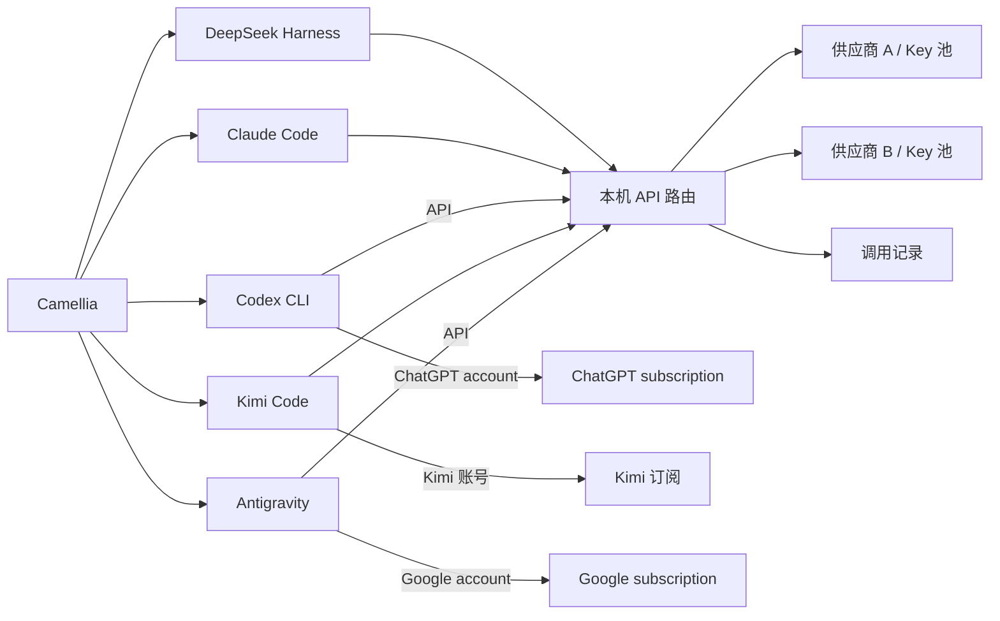

<p align="center">
  
</p>

<h1 align="center">Camellia</h1>

<p align="center">面向编程智能体的桌面工作平台。</p>

<p align="center"><a href="README.md">English</a> · <strong>简体中文</strong></p>

Camellia 将 **Claude Code、Codex CLI、DeepSeek Harness、Kimi Code 和 Antigravity** 集成到同一个桌面应用，集中管理供应商凭据、模型路由、调用用量和引擎设置，同时保留各引擎的执行机制与会话历史。

<table><tr><td>

</td></tr></table>

## 核心功能

- **多个引擎，共用应用。** 在 Claude Code、Codex CLI、DSH、Kimi Code 和 Antigravity 之间切换，使用统一的导航与设置。
- **五个引擎共享会话。** 保留同一份聊天记录和工作目录，支持直接切换或自动 Markdown 交接；各引擎首页和会话中的输入框位置统一。支持置顶、重命名、分叉和归档。
- **集中管理 API。** 在同一页面配置供应商、导入并命名 Key、读取模型目录和验证连接。
- **同模型线路切换。** 遇到可重试故障时，尝试提供同一模型的其他 Key 或供应商，不会自动替换为另一模型。
- **用量与账户信息。** 按供应商、Key、模型和日期筛选本机请求与 Token 统计；通过已适配的账户接口查看余额、订阅额度及历史曲线。
- **按需下载引擎。** 只安装需要的引擎，使用锁定版本，在设置中查看下载状态并重试失败的安装。
- **五个 harness 对比跑分。** 在 **Home → Benchmark** 中用同一模型、同一供应商运行五个引擎，自动评判任务结果，记录耗时与 Token，保存历史并导出 JSON。

## 快速开始

### 环境要求

- Windows x64 或 Apple Silicon（ARM64）macOS
- 从源码运行或构建时，需要 Node.js **22.x 系列的 22.19 及以上版本**，或 **24 及以上版本**；桌面构建已包含 Node.js
- Git；Windows 上请安装包含 Bash 的 Git for Windows，供引擎 Shell 工具使用
- 首次安装运行时所需的网络连接，以及可用的模型供应商凭据

### 从源码运行

```sh
git clone https://github.com/chengwang96/Camellia.git
cd Camellia
npm ci
npm start
```

`npm ci` 只安装工作台依赖，五个 harness 的运行时均为可选下载。可在首页点击 **Download & open**（下载并打开），也可在 **Settings → Runtime**（设置 → 运行环境）中单独下载。Antigravity 的 Google 订阅模式下载官方 CLI，API 模式下载 SDK 和独立 Python，无需全局安装 CLI 或 Python。

下载前可选择直连或使用已保存的代理。在 **设置 → Runtime → Download connection** 中填写自己的 HTTP/HTTPS 代理地址。默认直连，不预设代理地址；该设置用于引擎和 benchmark 题库下载。

开发时可执行 `npm run setup:runtimes -- dsh kimi`，只将指定引擎下载到 `runtimes/`。需要全部五个引擎时才使用 `--all`。启动工作台或浏览设置不会下载缺失的引擎。

应用默认语言为英文。在 **Settings → General → Language（设置 → 通用 → 语言）** 中选择 **English** 或 **简体中文**，保存后即可切换。

### 配置第一个会话

1. 打开 **Settings → Providers & Keys**（设置 → 供应商与 Key）。
2. 添加供应商，填入 API Key，选择或手动填写可用模型。
3. 保存配置，并用准备使用的模型验证 Key。
4. 返回首页，选择引擎与模型，开始会话。Claude、Codex、Kimi 和 Antigravity 均支持工作区会话与独立会话。

使用账号授权时，可直接打开 **Settings → Providers & Keys → Account sign-in**，选择 **Kimi account**、**Google account · Antigravity** 或 **ChatGPT account**。快捷入口会打开对应引擎的账号设置，并选中账号模式；如提示保存，先点 **Save settings**，再点 **Sign in**。添加 API 供应商的弹窗中也提供 Kimi 和 Google 的账号入口；**Kimi Code (API key)** 则用于填写订阅 API Key。

使用 ChatGPT 订阅时，打开 **Settings → Engine Settings → Codex CLI**，选择 **ChatGPT account** 并保存，点击 **Sign in with ChatGPT** 在浏览器完成官方登录，即可读取账号模型和额度。Codex 的配置、凭据与历史保存在 Camellia 自己的数据目录，不会修改个人 `~/.codex`。也可选择 **API key / third-party API** 使用统一 Key 池。

使用 Google 订阅时，在 **Settings → Engine Settings → Antigravity** 中选择 **Google subscription** 并保存，点击 **Sign in with Google** 完成官方 CLI 登录，再点击 **Refresh account** 获取账号可用模型，无需填写 API Key。

使用 Kimi Code 订阅时，打开 **Settings → Engine Settings → Kimi Code**，选择 **Kimi subscription** 和账号注册地区，保存后点击 **Sign in with Kimi**。在浏览器完成官方设备授权后，账号可用模型会自动加载，无需填写 API Key。已登录账号会显示在 **Providers & Keys** 和 **Usage**，可在 **Balances & Quotas** 查看周期额度、重置时间和历史趋势。此登录与个人 Kimi CLI 独立保存。也可选择 **Shared API routes** 使用统一 Key 池，包括 Kimi Code 订阅 Key。详见 [Kimi 订阅配置](docs/configuration.md#kimi-code-subscription)（英文）。

连接验证会发送一条简短的模型请求，可能产生少量费用。成功读取模型目录不代表对目录中的所有模型都具有调用权限。

使用 `Ctrl+,` 打开设置，`Ctrl+Shift+H` 返回首页。macOS 上将 `Ctrl` 替换为 `Cmd`。

## 用自己的 API 模型跑分

配置并验证 API 模型后，进入 **Home → Benchmark**。选择 **Question library** 时，界面会简要说明每个题库评测的能力：

默认选择 **5-minute preview（五分钟预览）**：五个引擎并行完成相同的三道轻量编程题，每题一次，每个引擎的三题共用 4.5 分钟，较慢的题可以多用一些时间；最后 30 秒留给检查和清理，整轮五分钟到时停止。用于初步了解代码修改、工具使用、响应速度和 token 消耗。引擎下载须在开始前完成，停止后的进程清理可能多用几秒；API 很慢或不可用时，有效样本可能不足。这个预览不评测视觉、长期记忆或复杂科研能力。

内置题集 **v2** 从基础 ASCII 文本格式修复开始，附带 `node check.cjs` 自测命令和全部六个验收用例，之后测试文件处理和多文件修复。较完整的 Unicode 规范化题保留在 **Standard（标准测试）** 中，标准题集共七题。入门题用于确认模型和 harness 能完成简单修改并运行检查；进一步比较能力时，结合耗时、Token 和较难任务。结果会显示题集版本，历史 v1 报告保留原题目和成绩。

展开 **Limits & scoring（限制与计分）** 查看预算和评分规则，展开 **Run details（运行详情）** 查看历史运行的完整参数。主界面保留能力简介、进度和结果。

<table><tr><td>

</td></tr></table>

*示例：使用 Ollama Cloud 上的 Kimi K3 进行五分钟预览。*

选择 **Full library（全集挂机）** 可运行所选题库的全部题目；**Custom sample（自选样本）** 保留题量和时限设置。全集模式显示任务与检查的累计时间额度，每次尝试后保存结果。挂机时保持应用打开、电脑唤醒；关闭应用会停止测试。

| 题库 | 主要评测能力 | 可选题量 |
| --- | --- | --- |
| Camellia 内置 | 基础编程和工具使用、文件处理、多文件修改。标准测试增加 Unicode 边界、算法、重试逻辑和配置追踪。 | 3 或 7 题 |
| [DS-1000](https://github.com/xlang-ai/DS-1000) | 数据科学编程：表格与数组处理、绘图，以及 pandas、NumPy、SciPy、Matplotlib、scikit-learn、PyTorch、TensorFlow 七个 Python 库的使用。 | 固定抽取 3/6/12 题，或完整的 1,000 题测试集 |
| [SciCode](https://github.com/scicode-bench/SciCode) | 科研编程：将科学问题转成数值方法、模拟和科学计算代码，并将多个子问题组合为可运行的解法。 | 固定抽取 3/6/12 题，或完整的 65 题测试集 |

1. 选择模型、供应商和题库，下载缺失的引擎。
2. 外部题库首次点击 **Prepare library**，下载校验后的数据和独立 Python 环境。下载使用已保存的连接，完成后缓存在本机。SciCode 的数值答案文件约 1.05 GB。
3. 选择题量、每题尝试次数（1 或 3 次）和运行限制。点击 **Run benchmark** 后，五个 harness 并行运行，每个引擎依次完成自己的任务。每次尝试使用新的工作目录和原生工具，由独立检查器验证产出文件。
4. 点击结果查看检查数、失败详情和文件改动。**Export JSON** 导出包含题目编号、来源版本、得分、用量和限制的报告。

**时间限制：**全集和自选样本模式按题库推荐每题时限：**内置题 5 分钟、DS-1000 10 分钟、SciCode 30 分钟**，也可手动选择到 60 分钟；所有引擎使用相同时限。开始前和历史报告中都会显示实际时限与 token 上限。延长时间不会自动增加 token 额度，需要时可单独调整每题 token 上限。

**Token 限制：**以每题每次尝试为单位，内置题默认 **25 万**、DS-1000 **50 万**、SciCode **100 万** token，可手动提高到 500 万。不同引擎和重复尝试各自获得完整额度；某题超限后只停止该次尝试，其他题继续。整轮上限为可选项，**默认关闭**，需要时可设置到 10 亿。开始前会显示单题上限和所有尝试的额度合计。这是用量上限，不是预计费用。

**计分方式：**主分数 **Check score** 是各次尝试检查通过比例的平均值，每道题和每次重复权重相同。**11/12 项检查通过可得 91.7 分**，显示为 **Partial**；同时保留整题通过率。运行/API 错误、超时和单题用量超限计零分。每评完一次就更新分数；未完成整组时显示 **Preliminary check score（暂定分数）** 和覆盖率，未开始及用户中止的尝试不记成答错。比较暂定成绩时，需要核对双方已完成的题目是否一致。

OCRBench、MMMU-Pro Vision、BEAM（1M）和 DeepSWE 已完成[接入评估](docs/design/benchmark-modes.md)，目前尚未加入可选题库。

SciCode 在调用模型前检查测试依赖和数值数据。**Grader error** 表示评测器异常，相关得分显示为不可用。已保存的答案支持[不调用模型直接重判](docs/configuration.md#recheck-saved-answers)，保留原报告备份和 API 用量记录。

**同分不一定意味着 harness 能力相同。** 同一模型可能采用相似解法，题库自身也可能存在测试限制。已复现 SciCode #46 对固定随机轨迹的依赖：数学上等价的蒙特卡洛接受规则可能被判成不同分数；#15 的原始题面还漏写了一个物理常数的系数。短题库避开这两道题，完整题库保留原始分数并明确提示；多个引擎错在相同检查时，报告也会标出。分数反映模型、harness、题目和运行限制的共同作用，不能单独归因于 harness。

跑分会消耗 API 额度，可随时停止。这里展示的是 Camellia 集成得分，范围为 0–100；即使使用官方 DS-1000/SciCode 题目和检查，也不等同于官方榜单成绩。SciCode 提供科学背景，要求一次实现全部子问题。比较结果时应保持题目、模型与供应商、版本和限制一致。跑分时 Codex 使用共享 API 线路，Antigravity 使用 API SDK，不受聊天连接方式影响。评分规则和限制见[配置指南](docs/configuration.md#benchmark)（英文）。

## 引擎集成方式

| 引擎 | 接入方式 | 桌面构建中的运行时来源 |
| --- | --- | --- |
| Claude Code | 通过 stream-json 驱动官方 CLI，使用 Camellia 管理的桌面界面 | 按需从官方 npm 包下载 |
| Codex CLI | 通过标准输入输出连接官方 app-server，支持 ChatGPT 订阅和共享 API 线路 | 按需从官方 npm 包下载 |
| DeepSeek Harness | 通过 ACP 接入公共会话界面，同时保留原生 Web 入口 | 按需下载，安装时应用源码补丁 |
| Kimi Code | 通过 ACP 连接官方运行时，支持 Kimi 订阅登录和共享 API 线路，使用公共会话界面 | 按需下载 |
| Antigravity | 官方 CLI 接入 Google 订阅，Python SDK 接入共享 API 线路，均使用 Camellia 会话界面 | 按需下载 CLI 或 SDK/Python |

安装版和便携版均不捆绑 harness 运行时，只提供共用的 Node.js/npm 下载工具，所选引擎安装到应用数据目录。DSH 的 pnpm 与 Antigravity 的 Python 随对应引擎下载，安装后会在后续启动时复用。Shell 工具在 macOS 上使用系统 Shell，在 Windows 上需要 Git Bash。

Camellia 保存统一的会话记录，并为各引擎分别保留原生会话。共享会话的执行目录固定，更换目录需要新建会话。共享侧栏只显示在 Camellia 中创建的会话，不自动导入旧开发版本或外部 CLI 的历史，也不维护旧会话格式兼容。

切换引擎会保留这段会话的 API 模型、工作目录、未发送文字、附件路径和阅读位置。每段会话分别记住 API 模型；ChatGPT／Google 账户模型单独保留。权限与推理设置按各引擎保存。顶部 **Engine** 菜单与会话内选择器使用同一切换流程；从首页返回或刷新页面会恢复上次会话或工作区草稿，缩放倍率也会跨重启保存。

Codex CLI 支持 API key 和第三方 API。在 **Settings → Engine Settings → Codex CLI** 选择 **API key / third-party API** 并保存，即可使用 **Providers & Keys** 中配置的模型，无需登录 ChatGPT。已有 Codex 原生会话保留原来的连接方式，连接设置用于新建的原生会话。

在会话顶部选择引擎即可切换。**Settings → General → Shared conversations** 可设置默认行为：

- **Continue directly**（默认）：下一条消息自动携带目标引擎缺少的上下文；切回原引擎时恢复它的原生会话，补上中间新增的记录。默认不弹提醒、不标记来源。
- **Automatic Markdown handoff**：前一个引擎生成交接摘要，自动保存为 `.md` 文件，再在目标引擎新建原生会话并发送摘要，全程自动完成，仍属于同一条共享会话。也可通过 **Switch options** 单次选择。
- 可单独启用切换提醒和来源标记。切换可能增加耗时与 token；原生缓存、运行中的工具和内部推理不能迁移，摘要可能遗漏细节。生成和接收交接会使用已配置的模型额度。

支持多个会话同时工作，包括同一 harness 中的多个会话。新建或打开其他会话不会停止后台任务，侧栏会显示工作和待确认状态；停止与权限确认只作用于对应会话。当前会话工作中（包括正在推进的 goal）时禁用 harness 切换和 Markdown 交接，先停止或暂停后才能切换。交接失败保留原会话和已生成的 Markdown；应用重启后不会自动重发未确认完成的请求。详见[实现与限制](docs/design/shared-conversations.md)。

### Goal 模式

点击 **Goal mode**（Ctrl/Cmd+G）设定目标，五个引擎都会持续推进，不再设置固定轮数上限。模型报告目标完成、用户暂停或移除目标，或遇到无法继续的阻塞时停止。可恢复的执行错误和模型报告的阻塞会连续尝试最多三次，再显示原因并停止；工作区或引擎无法启动时立即停止。完成状态由模型报告，并要求说明结果和验证情况。

紧凑的目标状态条显示目标、状态和累计运行时间。暂停会同时停止当前回复；展开可查看完整目标、阻塞原因，或手动 **Mark complete**。恢复时保留已有进展和累计时间。各会话的目标独立运行，打开其他会话不会暂停目标。关闭 Camellia 会暂停目标，需要点击 **Resume goal** 继续；切换该会话的引擎前应先暂停目标。执行沿用当前模型与权限设置。

Antigravity 支持 **Google subscription**（Google 订阅）与 **Shared API routes**（共享 API 线路）。订阅模式使用官方 CLI 的 Google 账号登录及账号可用的 Antigravity 额度，API 模式使用统一 Key 池。连接、权限、MCP 服务器与技能统一在 **Settings → Engine Settings → Antigravity** 中管理。已有会话保留原来的连接方式。Google 模式支持流式回复、续聊和停止，暂不支持分叉及图片附件。

当前 Antigravity SDK 连接支持文本和代码对话，暂不支持图片附件。图片对话可使用 Claude、Codex 或 Kimi，也可以搭配 Gemini 供应商。

## 供应商与模型路由

引擎与模型供应商分别选择。引擎负责工具和任务执行，本机 API 路由从已配置的线路中选择提供目标模型的连接。



连接预设包括 **Google Gemini API、Ollama Cloud、DeepSeek、Kimi / Moonshot、Kimi Code、Command Code GOAT、OpenCode Go 和 OpenCode Zen**，也支持自定义 OpenAI Chat Completions 与 Anthropic Messages 兼容接口。实际可用能力取决于协议与模型支持范围。

Gemini 预设使用 Google 的 OpenAI 兼容 API。Camellia 保留 Gemini 工具调用的思考签名，支持多轮调用与会话恢复。本机调用用量在统一用量页展示，账户账单与配额可在 Google AI Studio 查看。

同一线路组必须指向**相同模型及版本**，可以映射供应商使用的不同上游名称。额度耗尽（包括余额不足）、限流、认证失败和可重试的临时故障会触发组内切换；没有可用线路时，请求返回错误。已经开始输出内容的回复不会自动重放。

本机用量统计记录经过 Camellia 的请求；账户余额与订阅额度来自供应商接口，可能包含其他客户端的消费。部分适配使用未文档化接口或官方客户端中的接口。支持范围与验证边界见[配置指南](docs/configuration.md#balances-and-subscription-quotas)（英文）。

## 配置与数据

各引擎共用应用设置窗口，集中管理供应商连接、调用用量、账户余额、原生引擎选项、运行时安装和界面外观。

**保存 DSH、Claude、Kimi 和 Antigravity Google 连接的原生设置会更新对应 CLI 的全局配置**，也会影响 Camellia 之外的 CLI 会话。首次接管并覆盖已有文件前，会保留一份 `.workbench.bak` 原始备份。页面列出具体文件路径。Codex 和 Antigravity SDK 的设置仅作用于 Camellia。Codex 的 API 与 ChatGPT 连接还分别使用应用自己的登录和原生历史目录。

供应商 Key 保存在本机配置文件中。引擎使用本机路由地址和占位凭据；配置为使用该路由的 CLI 需要 Camellia 保持运行。

应用数据保存在 Windows 的 `%APPDATA%/dsh-desktop` 或 macOS 的 `~/Library/Application Support/dsh-desktop`。保留原有目录名称，以便沿用已有配置和会话。各引擎的数据目录及环境变量覆盖方式见[配置与数据位置](docs/configuration.md)（英文）。

<details>
<summary>用量与余额界面——演示数据</summary>

<table><tr><td>

</td></tr></table>

</details>

## 开发与构建

```sh
npm run dev    # 启动开发环境
npm test       # 运行单元与本地集成测试
npm run pack   # 构建当前平台的未封装应用
npm run dist   # 构建当前平台的分发文件
```

请在目标平台构建：`npm run dist:win` 生成 Windows x64 NSIS 安装器和 ZIP 便携版；`npm run dist:mac` 生成 macOS ARM64 DMG 和 ZIP 文件。macOS 构建需要 Apple Silicon Mac 与 ARM64 版 Node.js。

未封装应用位于 `dist/win-unpacked/Camellia.exe` 或 `dist/mac-arm64/Camellia.app`。Windows ZIP 便携版解压一次后，直接运行 `Camellia.exe`。请保留完整解压目录，包括 `resources/`。

```text
assets/         应用图标
src/
  main/         Electron 生命周期、IPC、进程与运行时管理
  api/          路由、协议转换、供应商适配与用量
  engines/      引擎会话、工作区与原生设置
  renderer/     首页、会话、设置及公共样式
  shared/       公共存储工具
integrations/   本项目维护的上游源码补丁
runtimes/       各引擎的包清单与版本锁定文件
scripts/        运行时准备、打包与独立工具
tests/          单元、集成、Electron 与浏览器检查
docs/           使用指南、技术说明与历史记录
```

构建流程、运行时版本、回归命令和贡献说明见[开发指南](docs/development.md)（英文）。`build/` 和 `dist/` 中的生成文件不纳入版本控制。

## 文档与上游项目

- [配置指南](docs/configuration.md)（英文）：供应商、线路切换、原生设置、用量与本机数据。
- [开发指南](docs/development.md)（英文）：架构、运行时、测试与打包。
- [文档索引](docs/README.md)：实现说明与归档设计记录，包含现有中文技术文档。

Camellia 集成 [Claude Code](https://github.com/anthropics/claude-code)、[Codex CLI](https://github.com/openai/codex)、[DeepSeek Harness](https://github.com/deepseek-ai/deepseek-harness)、[Kimi Code](https://github.com/MoonshotAI/kimi-code) 和 [Antigravity Python SDK](https://github.com/google-antigravity/antigravity-sdk-python)。DSH 与 Kimi Code 保留 MIT 许可证，Codex CLI 和 Antigravity Python SDK 源码采用 Apache-2.0 许可证。Claude Code 核心为专有软件；Camellia 接入其官方 CLI，不修改或再分发其核心。包括 SDK 原生运行时在内的各上游组件保留各自的许可证与使用条款。
