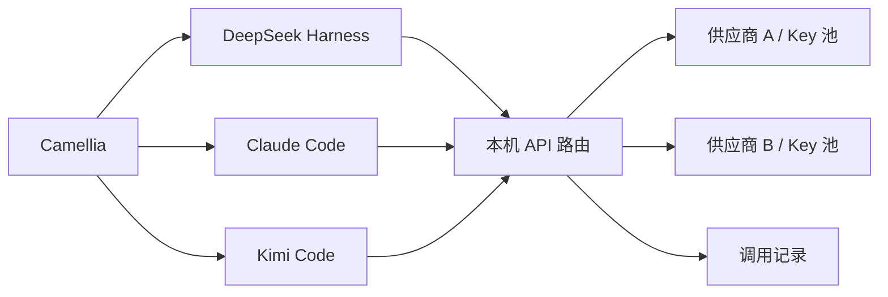

<p align="center">
  
</p>

<h1 align="center">Camellia</h1>

<p align="center">面向编程智能体的桌面工作平台。</p>

<p align="center"><a href="README.md">English</a> · <strong>简体中文</strong></p>

Camellia 将 **DeepSeek Harness、Claude Code 和 Kimi Code** 集成到同一个桌面应用，集中管理供应商凭据、模型路由、调用用量和引擎设置，同时保留各引擎的执行机制与会话历史。


## 核心功能

- **多个引擎，共用应用。** 在 DSH、Claude Code 和 Kimi Code 之间切换，使用统一的导航与设置。
- **工作区与独立会话。** 按本地文件夹组织 Claude 和 Kimi 会话，也可创建不属于任何工作区的会话；支持置顶、重命名、分叉、归档和续聊。
- **集中管理 API。** 在同一页面配置供应商、导入并命名 Key、读取模型目录和验证连接。
- **同模型线路切换。** 遇到可重试故障时，尝试提供同一模型的其他 Key 或供应商，不会自动替换为另一模型。
- **用量与账户信息。** 按供应商、Key、模型和日期筛选本机请求与 Token 统计；通过已适配的账户接口查看余额、订阅额度及历史曲线。
- **自动准备运行时。** 自动安装项目锁定的引擎版本，在设置中查看状态并重试失败的安装。

## 快速开始

### 环境要求

- Windows x64 或 Apple Silicon（ARM64）macOS
- 从源码运行或构建时，需要 Node.js **22.x 系列的 22.19 及以上版本**，或 **24 及以上版本**；桌面构建已包含 Node.js
- Git；Windows 上请安装包含 Bash 的 Git for Windows，供引擎 Shell 工具使用
- 首次安装运行时所需的网络连接，以及可用的模型供应商凭据

### 从源码运行

```sh
git clone https://github.com/chengwang96/Camellia.git
cd Camellia
npm ci
npm start
```

安装过程会在 `runtimes/` 下准备项目锁定的 DSH、Kimi 和官方 Claude 运行时，无需分别全局安装三个 CLI。下载失败时，可在 **Settings → Runtime**（设置 → 运行环境） 中重试，或执行 `npm run setup:runtimes`。

应用默认语言为英文。

### 配置第一个会话

1. 打开 **Settings → Providers & Keys**（设置 → 供应商与 Key）。
2. 添加供应商，填入 API Key，选择或手动填写可用模型。
3. 保存配置，并用准备使用的模型验证 Key。
4. 返回首页，选择引擎与模型，开始会话。Claude 和 Kimi 均支持工作区会话与独立会话。

连接验证会发送一条简短的模型请求，可能产生少量费用。成功读取模型目录不代表对目录中的所有模型都具有调用权限。

使用 `Ctrl+,` 打开设置，`Ctrl+Shift+H` 返回首页。macOS 上将 `Ctrl` 替换为 `Cmd`。

## 引擎集成方式

| 引擎 | 接入方式 | 桌面构建中的运行时来源 |
| --- | --- | --- |
| DeepSeek Harness | 内嵌 Web 界面，维护统一设置和前端启动所需的源码补丁 | 随构建提供 |
| Claude Code | 通过 stream-json 驱动官方 CLI，使用 Camellia 管理的桌面界面 | 首次使用时从官方 npm 包安装 |
| Kimi Code | 通过 Agent Client Protocol（ACP）连接开源运行时，使用公共会话界面 | 随构建提供 |

从源码安装时会准备全部三个运行时。桌面构建还包含 Node.js、npm 和 pnpm。Shell 工具在 macOS 上使用系统 Shell，在 Windows 上需要 Git Bash。

各引擎分别保存历史。DSH 保留原生项目体系。Claude 会话可以移动到其他工作区；已有 Kimi ACP 会话的执行目录固定，更换执行目录需要新建会话。

## 供应商与模型路由

引擎与模型供应商分别选择。引擎负责工具和任务执行，本机 API 路由从已配置的线路中选择提供目标模型的连接。



连接预设包括 **Ollama Cloud、DeepSeek、Kimi / Moonshot、Kimi Code、Command Code GOAT、OpenCode Go 和 OpenCode Zen**，也支持自定义 OpenAI Chat Completions 与 Anthropic Messages 兼容接口。实际可用能力取决于协议与模型支持范围。

同一线路组必须指向**相同模型及版本**，可以映射供应商使用的不同上游名称。额度耗尽（包括余额不足）、限流、认证失败和可重试的临时故障会触发组内切换；没有可用线路时，请求返回错误。已经开始输出内容的回复不会自动重放。

本机用量统计记录经过 Camellia 的请求；账户余额与订阅额度来自供应商接口，可能包含其他客户端的消费。部分适配使用未文档化接口或官方客户端中的接口。支持范围与验证边界见[配置指南](docs/configuration.md#balances-and-subscription-quotas)（英文）。

## 配置与数据

各引擎共用应用设置窗口，集中管理供应商连接、调用用量、账户余额、原生引擎选项、运行时安装和界面外观。

**保存原生引擎设置会更新对应 CLI 的全局配置**，也会影响 Camellia 之外的 CLI 会话。首次接管并覆盖已有文件前，会保留一份 `.workbench.bak` 原始备份。页面列出具体文件路径。

供应商 Key 保存在本机配置文件中。引擎使用本机路由地址和占位凭据；配置为使用该路由的 CLI 需要 Camellia 保持运行。

应用数据保存在 Windows 的 `%APPDATA%/dsh-desktop` 或 macOS 的 `~/Library/Application Support/dsh-desktop`。保留原有目录名称，以便沿用已有配置和会话。各引擎的数据目录及环境变量覆盖方式见[配置与数据位置](docs/configuration.md)（英文）。

<details>
<summary>用量与余额界面——演示数据</summary>


</details>

## 开发与构建

```sh
npm run dev    # 启动开发环境
npm test       # 运行单元与本地集成测试
npm run pack   # 构建当前平台的未封装应用
npm run dist   # 构建当前平台的分发文件
```

请在目标平台构建：`npm run dist:win` 生成 Windows x64 NSIS 安装器和 ZIP 便携版；`npm run dist:mac` 生成 macOS ARM64 DMG 和 ZIP 文件。macOS 构建需要 Apple Silicon Mac 与 ARM64 版 Node.js。

未封装应用位于 `dist/win-unpacked/Camellia.exe` 或 `dist/mac-arm64/Camellia.app`。Windows ZIP 便携版解压一次后，直接运行 `Camellia.exe`。请保留完整解压目录，包括 `resources/`。

```text
assets/         应用图标
src/
  main/         Electron 生命周期、IPC、进程与运行时管理
  api/          路由、协议转换、供应商适配与用量
  engines/      引擎会话、工作区与原生设置
  renderer/     首页、会话、设置及公共样式
  shared/       公共存储工具
integrations/   本项目维护的上游源码补丁
runtimes/       各引擎的包清单与版本锁定文件
scripts/        运行时准备、打包与独立工具
tests/          单元、集成、Electron 与浏览器检查
docs/           使用指南、技术说明与历史记录
```

构建流程、运行时版本、回归命令和贡献说明见[开发指南](docs/development.md)（英文）。`build/` 和 `dist/` 中的生成文件不纳入版本控制。

## 文档与上游项目

- [配置指南](docs/configuration.md)（英文）：供应商、线路切换、原生设置、用量与本机数据。
- [开发指南](docs/development.md)（英文）：架构、运行时、测试与打包。
- [文档索引](docs/README.md)：实现说明与归档设计记录，包含现有中文技术文档。

Camellia 集成 [DeepSeek Harness](https://github.com/deepseek-ai/deepseek-harness)、[Claude Code](https://github.com/anthropics/claude-code) 和 [Kimi Code](https://github.com/MoonshotAI/kimi-code)。DSH 与 Kimi Code 保留 MIT 许可证。Claude Code 核心为专有软件；Camellia 接入其官方 CLI，不修改或再分发其核心。各上游组件保留各自的许可证与使用条款。
