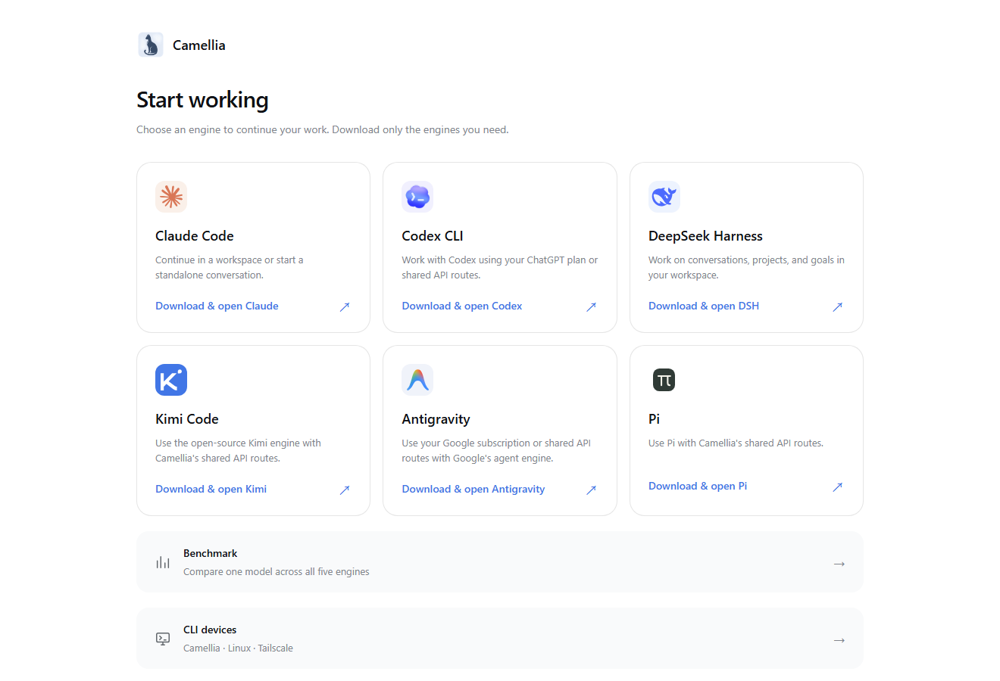
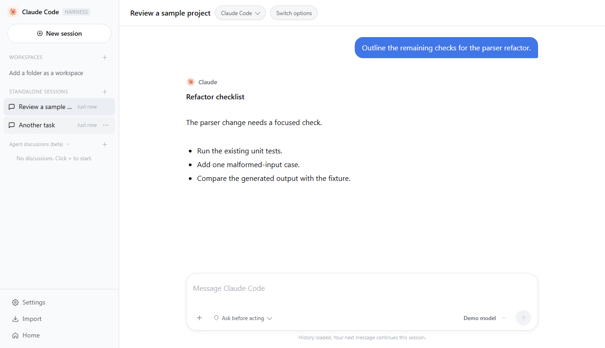

<p align="center"></p>

<h1 align="center">Camellia</h1>

<p align="center">本地与远程编码 Agent 的统一工作台。</p>

<p align="center"><a href="README.md">English</a> · <strong>简体中文</strong></p>

Camellia 将 **Claude Code、Codex CLI、DeepSeek Harness、Kimi Code、Antigravity 和 Pi** 放进同一个桌面工作台。你可以使用供应商 API Key 或受支持的订阅，在一个会话里切换引擎，并集中查看设置、用量和账号状态。配对的 Android 客户端和无界面的 Linux 服务器也能接入这套工作流。



## 核心能力

- **共享会话。** 在同一个工作区和会话中切换引擎，可直接继续，也可生成 Markdown 交接摘要；各引擎的原生历史仍由各自管理。
- **Agent 讨论（beta）。** 邀请最多四个已配置的 Agent，指定身份和回答者；桌面端与已配对的 Android 客户端都能查看消息、成员状态、工具过程和审批。
- **统一的路由与账号视图。** 在应用中管理 API 供应商、多把 Key、受支持的订阅登录、同模型故障转移、用量、余额和按需安装的运行时。
- **可比较的基准测试。** 用相同模型运行六个 Harness，选择内置题、DS-1000 或 SciCode，查看检查结果、耗时、tokens 和保存的报告。
- **远程工作。** 将无界面的 Linux 服务器配对为另一台工作台，或经内置 Tailscale 连接授权 Android 设备读取和控制指定桌面会话。
- **长期任务。** 目标模式、定时检查、消息队列和下一轮模型切换帮助管理跨越多轮回复的工作。桌面[工作面板](docs/conversation-work-panel.md)集中展示子任务与产物；手机使用轮次卡片和子任务页面，支持独立控制。



## 开始使用

从 [GitHub Releases](https://github.com/chengwang96/Camellia/releases/latest) 下载最新版本：

| 平台 | 下载文件 |
| --- | --- |
| Windows x64 | 安装版：`Camellia-Setup-<version>-win-x64.exe`；便携版：`Camellia-<version>-win-x64-portable.exe` |
| Android ARM64 | `Camellia-Android-<version>.apk` |

Windows 安装版按向导安装，便携版直接运行。桌面版本已包含 Node.js 和 npm；Windows 还需要安装附带 Git Bash 的 [Git for Windows](https://gitforwindows.org/)。Apple Silicon Mac 的运行与构建方式参阅[开发指南](docs/development.md)。

在桌面端首页选择引擎，并按提示安装。之后在 **设置 → 供应商与 Key** 配置 API 供应商，或在 **设置 → 引擎设置** 登录受支持的订阅。Camellia 只下载你选择的运行时。连接验证会发送一条简短的模型请求，可能产生供应商用量。

Android 安装与电脑配对参见 [Android 指南](android/README.md)和[远程访问指南](docs/remote-access.md)；无界面主机参见 [Linux 服务器指南](docs/linux-server-preview.md)。

### 从源码运行

桌面源码构建面向 **Windows x64** 和 **Apple Silicon Mac**。需要 Node.js **22.19 及以上的 22.x 版本，或 24 及以上版本**、Git；Windows 还需要附带 Bash 的 Git for Windows：

```sh
git clone https://github.com/chengwang96/Camellia.git
cd Camellia
npm ci
npm start
```

## 文档

[文档索引](docs/README.md)汇总配置、开发、远程访问、基准测试记录和设计文档。除这两份 README 外，指南均为英文。截图使用本地演示数据，展示当前界面，不代表真实账号或基准测试成绩。
