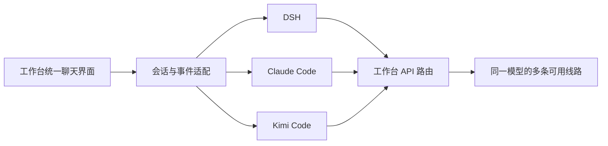

# Camellia 的多 Harness 接入方案

当前实现（2026-09-15）见 [统一设置与自动运行时](./unified-settings.md)：DSH 设置外壳已源码接入，DSH/Kimi 随包提供，Claude CLI 自动安装，三个引擎的设置统一管理。以下保留早期接入分析；其中“未替换运行时”“未同步全局设置”等描述已由当前实现更新。

早期核实日期：2026-09-14。接入排序依据官方源码、接口文档和当前应用结构；尚未对新 Harness 做真实模型调用评测。

## 已完成：工作台统一管理 Claude API

- Claude 内部只保留会话设置和模型选择。模型菜单读取工作台线路池，删除线路时保留原选择并标注未配置，不自动换模型。
- Claude 子进程固定连接工作台路由。独立端点、Token 和 Key 不再参与路由；没有可用线路时提示到工作台首页配置。
- Claude 设置 IPC 只收发会话字段。旧配置中的凭据保留在原文件，但不返回页面或用于连接；本机当前没有这类独立凭据，不需要迁移。
- 连接设置通过应用数据目录下的 CLI overlay 注入，没有修改用户的 `~/.claude/settings.json`。
- DSH 目前仍使用已有运行时和前端，工作台注入 `api-pool` 模型线路。DSH 自带的其他提供商配置仍然存在，完整统一聊天前端属于下一阶段。

## DeepSeek Harness：可以从源码开发

[官方仓库](https://github.com/deepseek-ai/deepseek-harness)采用 [MIT 许可证](https://github.com/deepseek-ai/deepseek-harness/blob/master/LICENSE)，提供从源码安装、构建和启动的流程。读取时根包版本为 `0.1.5-rc.2`，固定使用 `pnpm@11.7.0`，Node 支持 22.19+ 和 24+。这是开发分支信息，不代表经过本项目验证的稳定发行版。[构建配置](https://github.com/deepseek-ai/deepseek-harness/blob/master/package.json)

```powershell
git clone https://github.com/deepseek-ai/deepseek-harness.git
cd deepseek-harness
pnpm install
pnpm run build
pnpm dsh web
```

前端入口在 `apps/web`，使用 React 和 Vite，组件和插件分布在 `packages/client/*`。可以修改前端，也可以复用其组件实现工作台界面。[前端包](https://github.com/deepseek-ai/deepseek-harness/blob/master/apps/web/package.json)、[架构](https://github.com/deepseek-ai/deepseek-harness/blob/master/docs/architecture.md)

建议固定验证过的上游提交，在独立 checkout 和工作台专属 `DSH_HOME` 中验证历史兼容、配置与前端，再替换运行入口。现有应用设置已支持指定 `dsh` 入口文件，无须改动全局 npm 安装。上游更新应显式拉取并验证。

接口需要区分用途：

- Web / Remote 接口和源码前端适合保留完整交互体验。
- [SDK](https://github.com/deepseek-ai/deepseek-harness/blob/master/packages/sdk/server/README.md)提供 stdio JSON-RPC 和会话事件，可在适配中评估，不能假定覆盖整个 Web UI。
- 当前 [DSH ACP](https://github.com/deepseek-ai/deepseek-harness/blob/master/packages/acp/acp/README.md)定位为自动化接口，支持会话、模型、权限与取消，但缺少历史回放、分叉、终端视图和计划等交互表面。它不适合直接替换现有完整界面。

本轮已核对在线源码与构建说明；本机两次 Git clone 分别遇到连接重置和超时，后续官方源码归档下载不完整，已停止并清理部分归档。本轮没有完成整仓拉取、源码构建或运行时替换。

## 已接入：Kimi Code

优先考虑新的 [MoonshotAI/kimi-code](https://github.com/MoonshotAI/kimi-code)。旧 Python 项目的 [官方 README](https://github.com/MoonshotAI/kimi-cli)已经说明迁移方向；新版使用 TypeScript、MIT 许可并支持 Windows。[新版说明](https://github.com/MoonshotAI/kimi-code/blob/main/README.md)

现已固定并内置 `@moonshot-ai/kimi-code@0.43.0`，通过 `kimi acp` 子进程，以 stdin/stdout JSON-RPC 接入公共聊天界面。入口、主题、工作区列表、模型菜单、消息和工具卡片与 Claude 共用，实现位于 `src/renderer/chat/chat-runtime.js`、`src/engines/kimi-session.js` 和 `src/engines/session-workspaces.js`。[ACP 文档](https://github.com/MoonshotAI/kimi-code/blob/main/docs/en/reference/kimi-acp.md)

使用工作台专属 `KIMI_CODE_HOME` 隔离配置和数据，在其中的 `config.toml` 注入统一路由地址和占位凭据，真实 Key 继续由工作台持有。新版的目录和参数不同于旧 Python CLI。[配置目录](https://github.com/MoonshotAI/kimi-code/blob/main/docs/en/configuration/config-files.md)、[提供商](https://github.com/MoonshotAI/kimi-code/blob/main/docs/en/configuration/providers.md)

已通过真实 CLI 和 Electron 验证握手、文件夹内会话、恢复、停止、工具审批、图片、分叉以及同模型线路切换。工作区元数据、独立会话、置顶和归档也有隔离 IPC 测试。测试模型服务均为本机模拟端点，未调用付费 API。

当前 ACP 恢复和分叉会忽略传入的 `cwd`，所以已有 Kimi 会话不能换目录，菜单明确提供在目标工作区新建的操作。正常退出或替换进程之前先执行 `session/close`，避免刚返回的回复尚未落盘而在续聊或分叉时丢失。推理选项按 ACP 实际能力显示，不能直接复用 Claude 的固定档位。

订阅 OAuth 和可轮换 API Key 是不同凭据类型。当前工作台支持 Messages / Chat Completions；Responses、订阅 OAuth 刷新、Kimi 专用搜索服务尚未接入。ACP 0.43.0 在非表单客户端上会将多问题请求降为首个问题，本版按其权限选项界面显示。

## 其他候选

| Harness | 接入面 | 对工作台的价值 | 建议 |
|---|---|---|---|
| Kimi Code | ACP、MIT | 会话接口完整，配置目录可隔离 | 已作为第三个入口接入 |
| OpenCode | HTTP/OpenAPI、JS SDK，MIT | 前后端分离，适合自定义客户端 | 第二候选 |
| Pi | SDK、JSON RPC，MIT | 易于嵌入界面和定制 Agent 行为 | 深入定制时考虑 |
| Codex | 本轮不接入 | 后续单独验证配置和数据隔离 | 按用户要求暂缓 |

OpenCode 依据：[Server](https://github.com/anomalyco/opencode/blob/dev/packages/web/src/content/docs/server.mdx)、[SDK](https://github.com/anomalyco/opencode/blob/dev/packages/web/src/content/docs/sdk.mdx)、[License](https://github.com/anomalyco/opencode/blob/dev/LICENSE)。Pi 依据：[RPC](https://github.com/badlogic/pi-mono/blob/main/packages/coding-agent/docs/rpc.md)、[License](https://github.com/badlogic/pi-mono/blob/main/LICENSE)。排序是本项目的适配判断，不是模型效果排名。

## 统一前端的落地顺序



1. 沿用 `src/renderer/shared/ui-theme.css`，从现有工作区列表、输入框、消息和工具卡片提取公共组件；接入 Kimi 时按实际复用需要拆分。
2. 每个 Harness 用小型适配模块转换消息、工具、权限和运行状态。API 路由负责模型请求，会话适配层负责运行 Harness。
3. 会话保存所属 Harness、原生会话 ID 和工作区 ID。暂不跨 Harness 转换历史，避免工具消息和思考上下文丢失。
4. DSH 在固定源码版本上逐步采用公共组件，将提供商管理入口统一到工作台；菜单以接口实际支持的能力为准。
5. 各 Harness 使用工作台拥有的独立配置和数据目录。Codex 等用户恢复接入后再处理。
