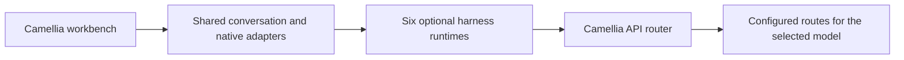

# Harness integration record

This document started as a 2026-09-14 evaluation. Some early proposals became implementation and some candidate rankings are obsolete. For current setup, use [Configuration](../configuration.md) and [Unified settings](unified-settings.md); for conversation behavior, use [Shared conversations](shared-conversations.md).

Camellia now has six desktop harnesses: Claude Code, Codex CLI, DeepSeek Harness (DSH), Kimi Code, Antigravity, and Pi. The workbench owns API keys and same-model routing, while each adapter owns native execution, messages, tool events, permissions, cancellation, and native history. Codex uses its official app-server interface for ChatGPT and shared API connections, with isolated app data. Kimi uses its ACP interface and isolated configuration. DSH's source integration retains its own web/settings surface where applicable. Each optional runtime is pinned and installed on demand.

The shared conversation layer stores a Camellia transcript and distinct native session bindings; switching engines does not move one engine's private reasoning state into another. Direct continuation passes the public history the target has not seen. A Markdown handoff explicitly summarizes and starts a fresh target session. See [Shared conversations](shared-conversations.md) and [model binding segments](model-switch-segments.md).

The original DSH source evaluation used the MIT-licensed upstream repository and its Node/pnpm build. The DSH web frontend and ACP automation endpoint serve different purposes: ACP does not by itself provide every web interaction. The original Kimi evaluation chose the TypeScript Kimi Code ACP over the earlier Python CLI, and verified handshake, restore, stop, tools, image input, and fork with a local model fixture. These historical fixture results are integration evidence, not live-model rankings. Upstream APIs and license terms must be checked again when bumping a pinned runtime.

```mermaid
flowchart LR
  UI[Camellia workbench] --> Sessions[Shared conversation and native adapters]
  Sessions --> Native[Six optional harness runtimes]
  Native --> Router[Camellia API router]
  Router --> Routes[Configured routes for the selected model]
```
